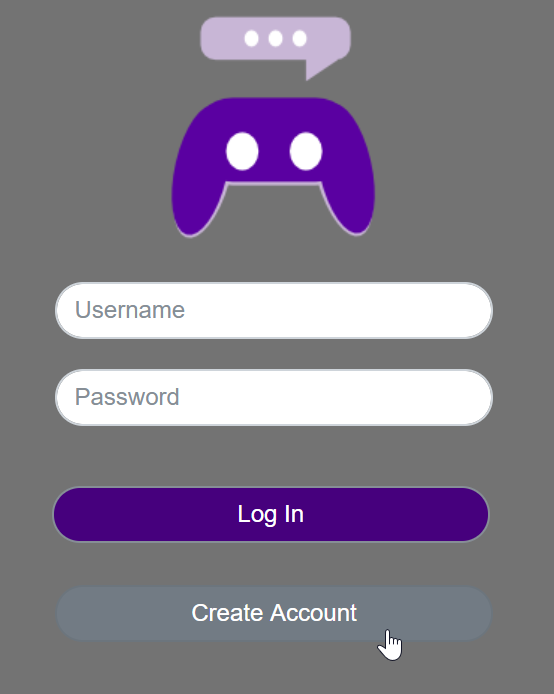
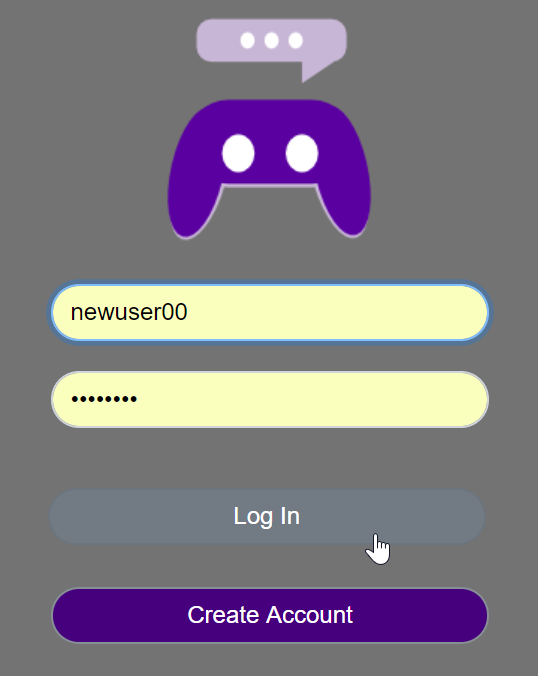
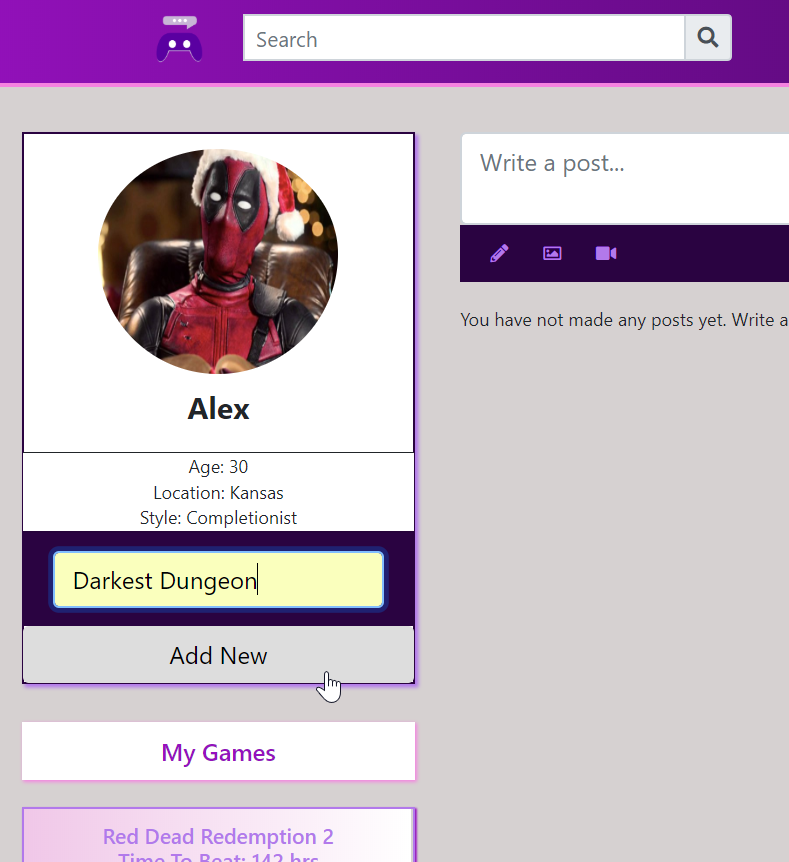
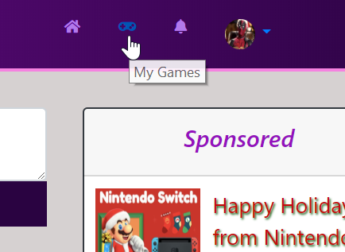
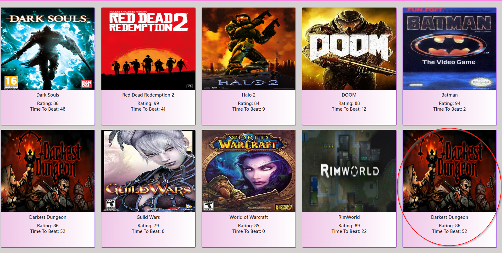

# WiredIn 

https://wiredin.herokuapp.com/

WiredIn is a free social networking site for gamers that allows registered users to create profiles, find and add their favorite games, and calculate the time required to complete their games based on their designated playstyle. 

New users will need to create an account:

When creating an account, the user will be prompted to fill out the following:
  * Username
  * Name
  * Password
  * Age 
  * Location
  * Play style ('Just the story', 'Story + Extras', '100% completion')
  * Prefered platform ('PC', 'Playstation', 'Xbox')

Existing users can simply log in with their username and password:

Once a user is logged in, they can add a game to their profile:

Adding a new game will then prompt an API call from IGDB. IGDB will find the game in their data base and return the game's cover art and rating. Sequelize NPM will post the new game to a MySQL database and associate it with the logged in user.
The 'howlongtobeat' NPM will also return the average time to finish the game based on the user's specified playstyle ('Just the story', 'Story + Extras', '100% completion')

Clicking the Games button in the top navbar will display all games in a user's library, including the newly added game:

----
### Technologies Used ###

* HTML
* CSS
  * Bootstrap
* JavaScript
* Handlebars
* MySQL
* Node.js
  * express and express-handlebars
  * mysql
  * sequelize
  * dotenv
  * howlongtobeat
  * igdb-api-node
* APIs
  * https://api.igdb.com/

